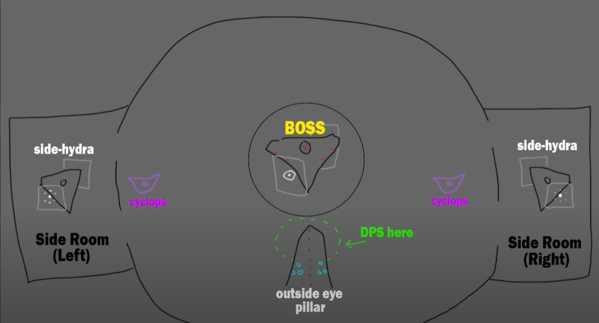
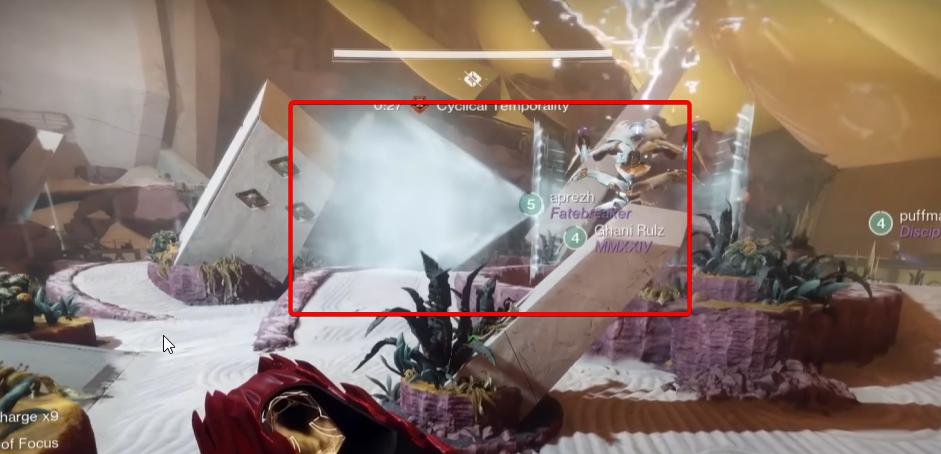
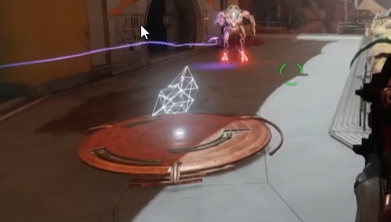
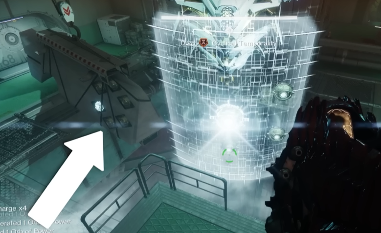
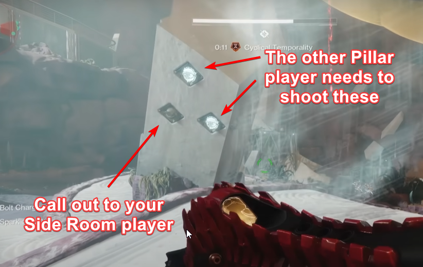

# Epoptes - Hydra Encounter 

Objective: defeat the big Hydra
The party will split into two groups of three, left and right

**Roles**
- [Side room](#side-room)
- [Outside pillar](#outside-pillar)
- Add clear

## Encounter Mechanic - Cyclical Temporality (CT)
This is a debuff that lasts 30 seconds. It's can be picked up from the two side plates after Cyclops are defeated in the center room. Important things about CT:

- If the timer runs out, you die
- The timer pauses while standing in a Hydra flashlight
- Standing in the Hydra flashlight also allows the player to see things that the other fire team members need to shoot. 

   
*The flashlight is generally on the same side as a shield*

The debuff can only be picked up if the plate is active, which is denoted by the glowing threads floating above it. 

:::note
**Both** plates must have a player standing on them before the debuff will be given. 
:::

## Encounter Overview
- Defeat minotaurs
- Cyclops will spawn. Defeat those to activate plates. 
- Side Room players will grab **CT** and run into their room
    - They'll start calling out eyes for each other too shoot
- Eventually three orbs will appear in the side rooms. The Outside Pillar players will tell their Side Room partners which to shoot
- Once the orb is shot, everyone meets up in the center again to defeat more minotaurs and cyclops
- Side Room players will return to the side rooms and finish shooting eyes, and the flashlight in their respective rooms
- Everyone meets in the center again
- Side Room players need to stand in the flashlight they can see and destroy it
- Damage phase begins
- Rinse and repeat 

### Side Room 

When the Side Room players get CT they'll need to run into their side room and stay in the flashlight beam as long as possible. Doing so will pause the CT timer. 
While in the room, the player will also see six eyes on the hydra. The goal is to shoot those in the correct order. 

The player will want to be in the flashlight beam for two reasons:
- It pauses the CT countdown
- It will light up a pattern in the room, which can be used to tell the other Side Room player which eye to shoot first.

  
*The lit orb is which eye the other Side Room player needs to shoot*

While standing in the beam, they'll also be able to see 

    - Side Room players will stand in the Hydra's flashlight, allowing them to see what eyes the other room needs to shoot
    - Eventually three floating eyes will appear above the hydra. 
        - The Outside Pillar player will call out which one to shoot for their own side
    - Shoot the correct orb, then rejoin the players outside of the room.

### Outside Pillar
Your job is to figure out which of the three floating orbs your Side Room player needs to shoot. You'll do this with the pillar in the center room, which has six conspicuous **divots**, three for each side. 

You'll know it's time to get CT when you see the following text appear:

> Epoptes blocks the unforseen and prompts function collapse

Once this happens, pick up Cyclicla Temporality and stand in the flashlight. Two of the **divots** should light up. The dark divot is what your Side Room partner needs to shoot. 

