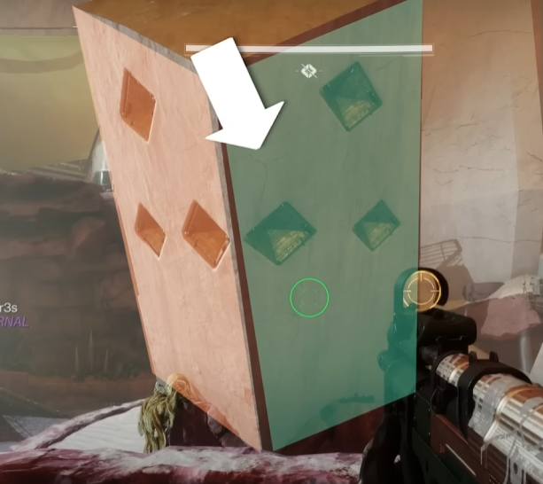

# Epoptes - Hydra Encounter 

Objective: defeat the big Hydra
The party will split into two groups of three, left and right

**Roles**
- [Side room](#side-room-role) - 2 players
- [Center Pillar](#center-pillar-role) - 2 players
- Add clear - 2 players

## Encounter Mechanic - Cyclical Temporality (CT)
This is a debuff that lasts 30 seconds. It's can be picked up from the two side plates after Cyclops are defeated in the center room. Important things about CT:

- If the timer runs out, you die
- The timer pauses while standing in a Hydra flashlight
- Allows the player to see things that the other fire team members need to shoot. 
- Allows the player to destroy certain things, such as the a hydra shield's flashlight

   
*The flashlight is generally on the same side as a shield*

The debuff can only be picked up if the plate is active, which is denoted by the glowing threads floating above it. 

:::note
**Both** plates must have a player standing on them before the debuff will be given. 
:::

## Encounter Overview
- Defeat minotaurs
- Cyclops will spawn. Defeat those to activate plates. 
- Side Room players will grab **CT** and run into their room
    - They'll start calling out eyes for each other too shoot
- Eventually three orbs will appear in the side rooms. The Center Pillar players will tell their Side Room partners which to shoot
- Once the orb is shot, everyone meets up in the center again to defeat more minotaurs and cyclops
- Side Room players will return to the side rooms and finish shooting eyes, and the flashlight in their respective rooms
- Everyone meets in the center again
- Side Room players need to stand in the flashlight they can see and destroy it
- Damage phase begins
- Rinse and repeat 

### Side Room Role

When the Side Room players get CT they'll need to run into their side room and stay in the flashlight beam as long as possible. Doing so will pause the CT timer. 
While in the room, the player will also see six eyes on the hydra. The goal is to shoot those in the correct order. The other Side Room player can tell you the order. 

There's a pattern in the room. Standing in the hydra's flashlight beam will illuminate one of the circles in the pattern. That circle represents which eye the other Side Room player needs to shoot. 

  
*The lit circle is which eye the other Side Room player needs to shoot*

When the other Side Room player calls out which part of the pattern is lit up, shoot that eye. 

#### Orbs
Eventually three floating orbs will appear above the hydra. The Center Pillar player for your side needs to tell you which one to shoot. 

:::warning
Note that the orbs do **NOT** rotate with the hydra's shield. Keep that in mind when circling around the room. 
:::

Once you shot the correct orb, go to the center room to defeat more minotaurs and hydras. 

#### Repeat
Once finished in the center you'll reenter your room and repeat the process of shooting eyes on the shield. 

Once all eyes on the shield are destroyed, you can then destroy the flashlight, which will defeat the hydra in your room. Return to the the center room. 

#### Start Damage Phase
Once in the center, the boss will have another flashlight that only you can see. The other Side Room player will also have a flashlight only they can see. Both Side Room players need to destroy their flashlights, which will start the damage phase. 

### Center Pillar Role
Your job is to figure out which of the three floating orbs your Side Room player needs to shoot, as well as which divots the other Center Pillar player needs to shoot. You'll do this with the pillar in the center room, which has six conspicuous **divots**, three for each side. To see which one your partner needs to shoot, you'll need CT. 

You'll know it's time to get CT when you see the following text appear:

> Epoptes blocks the unforseen and prompts function collapse

Once this happens, pick up CT and stand in the flashlight. Two of the **divots** should light up. The dark divot is what your Side Room partner needs to shoot. The two lit up eyes are what the **other** Center Pillar player need to shoot. Center Plillar players must be in the flashlight beam to be able to shoot their partner's divots. 

  
*Remember to stand in the flashlight beam when shooting the lit up divots*

When done correctly, you should see the following in the activity feed:

> Functional collapse suppressed

### Damage Phase

During the damage phase, there's a mechanic that can be used to extend it. The mechanic happens multiple times, and each player will be called eventually. 

During damage, the boss will become invulnerable. Two players will each see a flashlight beam coming out of the boss' shield. Note that these players will only see one beam, so they'll know which is theirs. Both players need to stand in their respective beams. Once they do, six eyes will appear. 

Both players need to destroy all six eyes, and then the flashlight in the center. Once both players do this, damage phase resumes.

The invulnerability mechanic will happen three times during a single damage phase, and no two guardians will be called twice. 

The damage phase if very long. Many teams went with five players using Outbreak Perfected, and one player using Tractor Cannon, combined with Well and damage supers. 