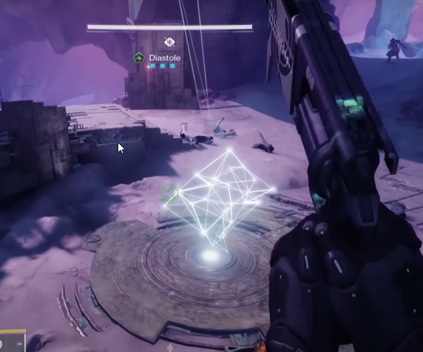

# Iatros - Wyvern Encounter

Objective: Build a series of platforms so your climber can grab a mcguffin at the top, which then allows you to damage Iatros. 

**Roles**
- [Tower Shooting](#tower-shooting-role) - 3 players
- [Climber](#climber-role) - 1 player
- [Chronon Duty](#chronon-duty-role) - 2 players

## Encounter Mechanic - Chronons (Sand)

Minotaurs will drop an object called Chronons. 

Chronons is deposited into the hourglass by jumping through a ring in the arena. 

## Encounter Mechanic - Ring and Hourglass

There's an hourglass and ring floating in the middle of the room that acts as a timer. Things you need to know about the ring and hourglass:

- The yellow stuff below the ring is how many Chronons are stored
- If the hourglass is empty, the raid wipes
    - This can happen during the damage phase
- You deposit more chronons by picking them up, and then jumping through the ring. 
- The color of the ring tells you which plate DPS starts at
- Messing up other mechanics can cause the hourglass to lose some Chronons

## Encounter Mechanic - Diastole
Appears as a buff at the top of the screen with four boxes. Boxes fill up over a few seconds. Once all four boxes fill up, your guardian will be launched into the air. 

- The fourth box filling doesn't effect your guardian if you're already in the air, so jumping at the right moment can prevent you from being launched up uncontrollably. 
- Diastole doesn't damage your guardian, it's just annoying and something you have to get used to. 
- The timing of the boxes filling up is important for the Tower Shooting role. 

## Encounter Overview

#### Opening
- Start by walking to the blue plate
- Six minotaurs spawn. Defeat all of them
- Every player should pick up a Chronon and deposit it into the hourglass
- Once full, shoot the Vex diamond below the hourglass to start the encounter 

#### Main Phase
- The Climber heads to the damage phase plate (based on ring color), and collects their debuff
- The Tower Shooters try to time shooting the bottom boxes in their towers
    - When successful, platforms will spawn above the damage phase plate. 
    - The Climber ascends the platforms and activates their platform box
- The Tower Shooters destroy the middle tower box
    - The Climber ascends again, activating the second platform box
- The Tower Shooters destroy the top and final tower box
    - The Climber ascends one more time and activates the final platform box, notifying the team before they do so
- The party moves to the damage plate

#### Damage Phase
The boss will teleport to a plate and start walking if there's no one next to them. The box always walks towards higher plates, unless they're at the top. 
Damage phase ends, and the cycles starts again with six minotaurs spawing at the blue plate. 

### Tower Shooting Role
At the start, determine which tower is yours. There are three in total in the room. At the start they'll have three vertical diamonds before the encounter begins

Once Diastole starts, they'll turn into cubes. 

Your job is to shoot the boxes on the tower at the exact same time as the other two Tower Shooters. The timing is dependent on Diastole. You want to shoot right as the fourth box fills, but before you get launched in the air. Think of it as a countdown: 3...2...1...Shoot! 

🎵 There are also audio cues that play when Diastole boxes fill up, which can be used to help with the timing 🎵

Boxes are shot from the bottom up. Each destroyed box will create a series of platforms for the climber to ascend. 

If all the Tower Shooting members fail to destroy their boxes at the same time, the hourglass loses some chronons. 

> Chronons dissipate with instability

:::note
Note that you don't need to shoot the box every time Diastole fills up. It's only a penalty if the timing is wrong. 
:::

Once the climber has ascended and collected their box at the top of the newly spawned platforms, the tower team can try to time the next shot. 

:::important
Make sure the climber is ready before shooting the next cube. Destroying a cube spawns new platforms, and makes the previous set disappear! If the climber falls you'll have to start all over again. 
:::

### Climber Role

Start at the Damage Phase plate (check the color of the Ring). You'll see a floating structure. Touching the structure will give you a debuff called **Absolute Temporality**, which is needed to progress the encounter. The debuff lasts 90 seconds. 

When the Tower Shooting successfully destroy a box, three platforms will appear, allowing you to ascend. At the top of the third platform will be a box you can activate. Doing so allows the Tower Shooting team to shoot the next box, and refreshes the duration on Absolute Temporality. 

Collecting the third (and final) box will start the damage phase. Make sure to give your teammates a chance to get to the damage plate before picking it up. 

#### Imps

The main danger for the climber are Vex Imps that continuously spawn. Do your best to fend them off. Rocket sidearms or rocket pulse rifles are recommended. Invisibility and barricades help as well. 

### Chronon Duty Role
This role is basically add clear, except you want to focus on taking down minotaurs and depositing chronons to buy your team more time. 

### Damage Phase 
The boss will spawn at the colored plate matching the ring's color. If the players are far away, the boss will walk to a predetermined plate depending on which plate it started on. If the raid goes to the same plate as the boss, it'll basically stay there and shoot at the raid, allowing for hard-hitting close-ranged weapons to shine, such as Lord of Wolves and Legend of Acrius. 

Boss walking direction

|Starts at|Walks towards|
|---|---|
|Red Plate|Blue Plate|
|Blue Plate|White Plate|
|White Plate|Blue Plate|

Once damage phase ends, six more minotaurs will spawn, allowing the players to deposit and repeat the whole process. 