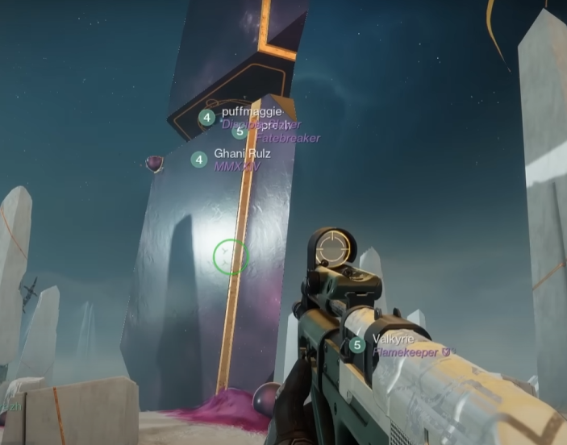

# Desert Perpetual 🏜️
The raid contains four encounters. The first three are non-linear, and the fourth is only available once the first three have been completed. 

When starting the raid, run forward until you see a large purple tower. Ascend that to activate one of the first three encounters.



```mdx-code-block
import DocCardList from '@theme/DocCardList';

<DocCardList />
```

